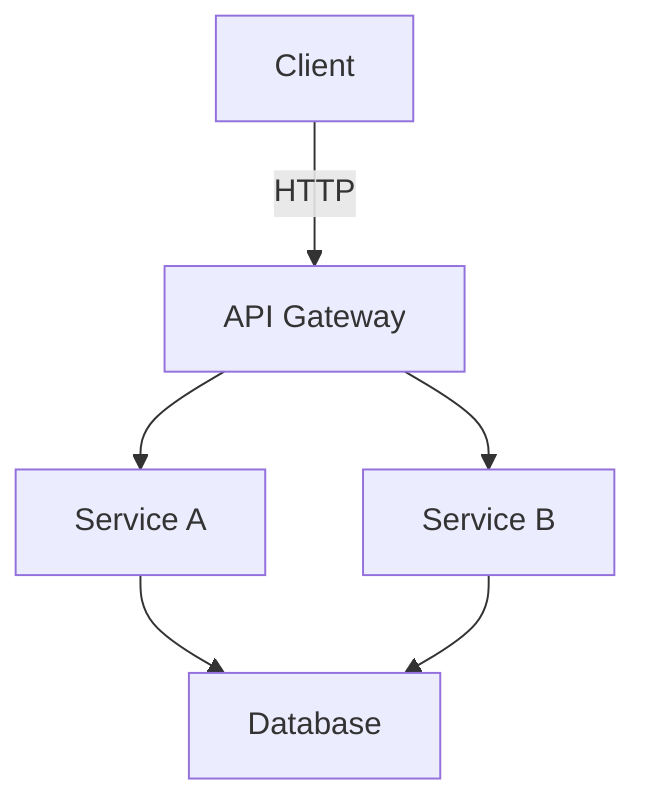

# Architecture Documentation

This directory contains architecture and design documentation for the Horizon ecosystem.

## Overview

Architecture documentation helps developers and stakeholders understand:
- System design and structure
- Component interactions
- Design decisions and rationale
- Technical specifications
- Scalability considerations
- Security architecture

## Documentation Types

### System Architecture

Document the overall system architecture:
- High-level system diagram
- Component breakdown
- Technology stack
- Infrastructure overview
- Deployment architecture

### Design Documents

Create design documents for:
- New features or modules
- Significant changes to existing systems
- Technical debt resolution
- Performance improvements
- Security enhancements

### Technical Specifications

Detailed technical specs for:
- Protocols and interfaces
- Data models and schemas
- Integration contracts
- Performance requirements
- Security requirements

## Recommended Structure

```
architecture/
├── README.md                    # This file
├── system-overview.md           # High-level system architecture
├── components/                  # Component-specific architecture
│   ├── component-a.md
│   └── component-b.md
├── design-docs/                 # Design decision records
│   ├── 001-decision-title.md
│   └── 002-another-decision.md
├── diagrams/                    # Architecture diagrams
│   ├── system-architecture.png
│   └── data-flow.png
└── specifications/              # Technical specifications
    ├── api-contracts.md
    └── data-models.md
```

## Creating Architecture Documents

### System Architecture Documents

Include:
1. **Overview**: High-level description
2. **Components**: Key system components
3. **Interactions**: How components communicate
4. **Data Flow**: How data moves through the system
5. **Technology Stack**: Technologies used
6. **Scalability**: How the system scales
7. **Security**: Security measures and considerations
8. **Deployment**: How the system is deployed

### Design Decision Records (ADR)

Use this format for recording important decisions:

```markdown
# ADR-001: Title of Decision

## Status

[Proposed | Accepted | Deprecated | Superseded]

## Context

What is the issue that we're seeing that is motivating this decision?

## Decision

What is the change that we're proposing and/or doing?

## Consequences

What becomes easier or more difficult to do because of this change?

## Alternatives Considered

What other options were considered and why were they not chosen?
```

## Diagrams

Use diagrams to illustrate:
- System architecture
- Component interactions
- Data flow
- Deployment topology
- Network topology
- Security boundaries

### Diagram Tools

Recommended tools:
- **Mermaid**: Text-based diagrams in Markdown
- **Draw.io**: Visual diagramming tool
- **PlantUML**: Text-based UML diagrams
- **Lucidchart**: Collaborative diagramming

### Mermaid Example



## Best Practices

1. **Keep it current**: Update docs when architecture changes
2. **Use diagrams**: Visual representations aid understanding
3. **Explain decisions**: Document why, not just what
4. **Consider audience**: Write for various technical levels
5. **Version control**: Track changes to architecture over time
6. **Link to code**: Reference relevant code repositories
7. **Review regularly**: Ensure documentation stays accurate

## Document Templates

### System Component Template

```markdown
# Component Name

## Purpose
What this component does and why it exists.

## Responsibilities
- Responsibility 1
- Responsibility 2

## Dependencies
- Component A: Why this dependency exists
- Component B: Why this dependency exists

## Technology Stack
- Language/Framework
- Key libraries
- Infrastructure

## Interfaces
- API endpoints
- Events published/consumed
- Data stores accessed

## Configuration
How the component is configured.

## Monitoring
What metrics are tracked and how to monitor health.

## Deployment
How the component is deployed.
```

## Contributing

When adding architecture documentation:

1. Follow the established structure
2. Include relevant diagrams
3. Explain design rationale
4. Document trade-offs considered
5. Link to related documentation
6. Keep language clear and accessible
7. Follow the [Style Guide](../guides/STYLE_GUIDE.md)

## Related Documentation

- [Module Documentation](../modules/)
- [API Documentation](../api/)
- [Style Guide](../guides/STYLE_GUIDE.md)
