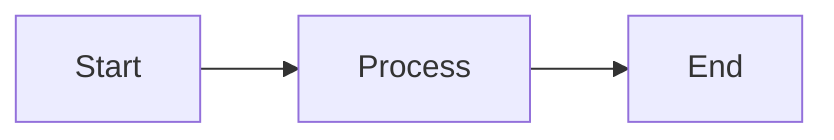

# Documentation Style Guide

This style guide ensures consistency across all module documentation in the Horizon ecosystem.

## Purpose

This guide helps contributors write clear, consistent, and helpful documentation for all Horizon modules.

## General Principles

1. **Clarity**: Write for users who may be unfamiliar with the module
2. **Consistency**: Follow established patterns and structures
3. **Completeness**: Cover all essential aspects of the module
4. **Maintainability**: Keep documentation up-to-date with code changes
5. **Accessibility**: Use clear language and provide examples

## Document Structure

All module documentation should follow this structure:

### Required Sections

1. **Overview**: Brief description and purpose
2. **Installation**: How to install the module
3. **Quick Start**: Simple example to get started
4. **Configuration**: Configuration options and examples
5. **Usage**: How to use the module
6. **API Reference**: Detailed API documentation
7. **Troubleshooting**: Common issues and solutions

### Optional Sections

- Integration guides
- Performance considerations
- Security considerations
- Migration guides
- Advanced usage patterns
- Examples and tutorials

## Writing Style

### Tone and Voice

- Use second person ("you") when addressing the reader
- Use active voice ("The function returns" not "The return is done by")
- Be concise and direct
- Use present tense for current behavior

### Examples

**Good:**
```
You can configure the module by passing options to the constructor.
```

**Avoid:**
```
The module might be configured by the user through options that are passed to the constructor.
```

## Formatting Guidelines

### Headers

- Use sentence case for headers
- Use `#` for title, `##` for main sections, `###` for subsections
- Keep headers descriptive and scannable

### Code Blocks

Always specify the language for syntax highlighting:

````markdown
```javascript
const example = 'code';
```
````

### Lists

Use bullet points for unordered lists:
- Item 1
- Item 2

Use numbers for sequential steps:
1. First step
2. Second step

### Tables

Use tables for structured data:

| Column 1 | Column 2 | Column 3 |
|----------|----------|----------|
| Data 1   | Data 2   | Data 3   |

### Links

Use descriptive link text:

**Good:**
```markdown
See the [installation guide](installation.md) for details.
```

**Avoid:**
```markdown
Click [here](installation.md) for more information.
```

## Code Examples

### Best Practices

1. **Include complete examples**: Examples should be runnable
2. **Show common use cases**: Cover typical scenarios
3. **Handle errors**: Demonstrate error handling
4. **Add comments**: Explain non-obvious code
5. **Keep it simple**: Start simple, then show advanced usage

### Example Template

```javascript
// Import the module
const Module = require('@horizon/module-name');

// Create an instance with configuration
const instance = new Module({
  option1: 'value',
  option2: true
});

// Basic usage
instance.doSomething()
  .then(result => {
    console.log('Success:', result);
  })
  .catch(error => {
    console.error('Error:', error);
  });
```

## API Documentation

### Function Documentation

Document all public functions with:

- **Description**: What the function does
- **Parameters**: List all parameters with types and descriptions
- **Returns**: What the function returns
- **Throws**: Any exceptions thrown
- **Example**: Usage example

#### Template

```markdown
### functionName(param1, param2)

Brief description of what the function does.

**Parameters:**
- `param1` (Type): Description
- `param2` (Type): Description

**Returns:**
- (Type): Description of return value

**Throws:**
- `ErrorType`: When this error occurs

**Example:**
```javascript
const result = functionName('value1', 'value2');
```
```

### Class Documentation

Document classes with:

- **Description**: Purpose of the class
- **Constructor**: Constructor parameters
- **Properties**: Public properties
- **Methods**: Public methods

## Configuration Documentation

Use tables for configuration options:

| Option | Type | Default | Required | Description |
|--------|------|---------|----------|-------------|
| name | string | - | Yes | Description |
| port | number | 8080 | No | Description |

## Diagrams and Visuals

When helpful, include:
- Architecture diagrams
- Flow charts
- Sequence diagrams
- Screenshots

Use Mermaid for diagrams when possible:



## Version Documentation

- Document version-specific features
- Note breaking changes clearly
- Provide migration guides for major versions
- Keep a CHANGELOG.md file

## Accessibility

1. Use descriptive alt text for images
2. Don't rely solely on color to convey information
3. Use clear, simple language
4. Provide text alternatives for visual content

## Review Checklist

Before submitting documentation:

- [ ] All required sections are present
- [ ] Code examples are tested and work
- [ ] Links are valid and point to correct locations
- [ ] Spelling and grammar are correct
- [ ] Formatting is consistent
- [ ] API documentation is complete
- [ ] Examples cover common use cases
- [ ] Troubleshooting section addresses known issues

## Common Mistakes to Avoid

1. **Assuming knowledge**: Don't assume users know context
2. **Incomplete examples**: Provide complete, runnable code
3. **Outdated information**: Keep docs in sync with code
4. **Missing error handling**: Show how to handle errors
5. **Poor organization**: Use clear structure and headers
6. **Technical jargon**: Explain technical terms
7. **No examples**: Always provide code examples

## Tools and Resources

### Markdown Editors

- [Visual Studio Code](https://code.visualstudio.com/) with Markdown extensions
- [Typora](https://typora.io/)
- [MacDown](https://macdown.uranusjr.com/) (macOS)

### Linting

Use markdownlint to check documentation:

```bash
markdownlint docs/**/*.md
```

### Preview

Preview your documentation:
- GitHub preview tab
- Local Markdown viewer
- Documentation site generator

## Questions?

If you have questions about documentation style:
- Check existing module documentation for examples
- Open an issue for clarification
- Contact the documentation team

## Updates

This style guide is maintained by the documentation team. Suggestions for improvements are welcome!
